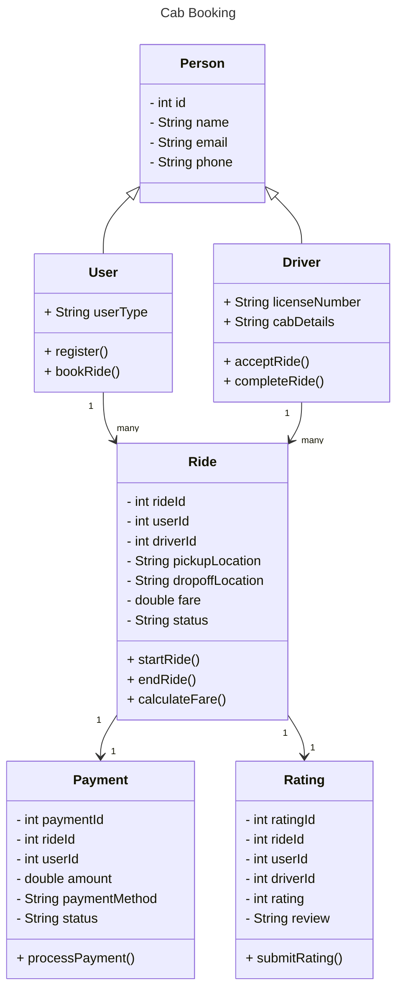

# Cab Order Booking
## About Version 3.1.1
  Welcome to the CAB Booking Application! This application allows users to book cabs, track rides, and rate drivers. This README provides an overview of the project, its setup, and its functionalities.

## Features
-User Registration and Login: Users can register and log in to the application.

-Driver Registration and Login: Drivers can register and log in to the application.

-Cab Booking: Users can book cabs by providing pickup and drop-off locations.

-Ride Tracking: Users can track their ride status.

-Driver Rating: Users can rate drivers after completing their rides.

Technologies Used
Java: Core programming language used for application development.

Prerequisites
Java Development Kit (JDK) 21 or higher

## Tables
-Users

-Drivers

-Rides

-Locations

-Payments

-Ratings

## Contributing
We welcome contributions from the community! If you find a bug or want to add a feature, please open an issue or submit a pull request.

#   inheritance cab order booking

## class Diagram

