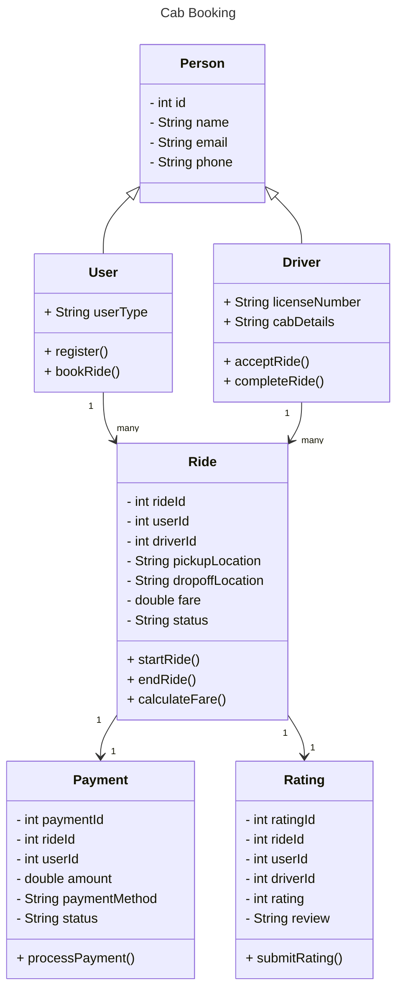

#   inheritance cab order booking

## class Diagram

```mermaid
---
title: Cab Booking
---
classDiagram
  class Person {
        - int id
        - String name
        - String email
        - String phone
    }

    class User {
        + String userType
        + register()
        + bookRide()
    }

    class Driver {
        + String licenseNumber
        + String cabDetails
        + acceptRide()
        + completeRide()
    }

    class Ride {
        - int rideId
        - int userId
        - int driverId
        - String pickupLocation
        - String dropoffLocation
        - double fare
        - String status
        + startRide()
        + endRide()
        + calculateFare()
    }

    class Payment {
        - int paymentId
        - int rideId
        - int userId
        - double amount
        - String paymentMethod
        - String status
        + processPayment()
    }

    class Rating {
        - int ratingId
        - int rideId
        - int userId
        - int driverId
        - int rating
        - String review
        + submitRating()
    }

    Person <|-- User
    Person <|-- Driver
    User "1" --> "many" Ride
    Driver "1" --> "many" Ride
    Ride "1" --> "1" Payment
    Ride "1" --> "1" Rating
```